# 📦 Sistema de Gestión Comercial y Pedidos CEDIS - Cloro de Hidalgo


Ecosistema digital de alto rendimiento diseñado para centralizar, automatizar y optimizar la logística entre las sucursales de **Cloro de Hidalgo** y su Centro de Distribución (CEDIS). Esta plataforma cubre desde la planificación de demanda hasta la liquidación de nómina de transporte pesado.

---

## 🚀 1. Acceso y Seguridad (Branding Corporativo)
El sistema implementa una interfaz de vanguardia con **Glassmorphism**, garantizando una experiencia visual premium desde el primer contacto.

| Vista de Acceso | Descripción |
| :--- | :--- |
| 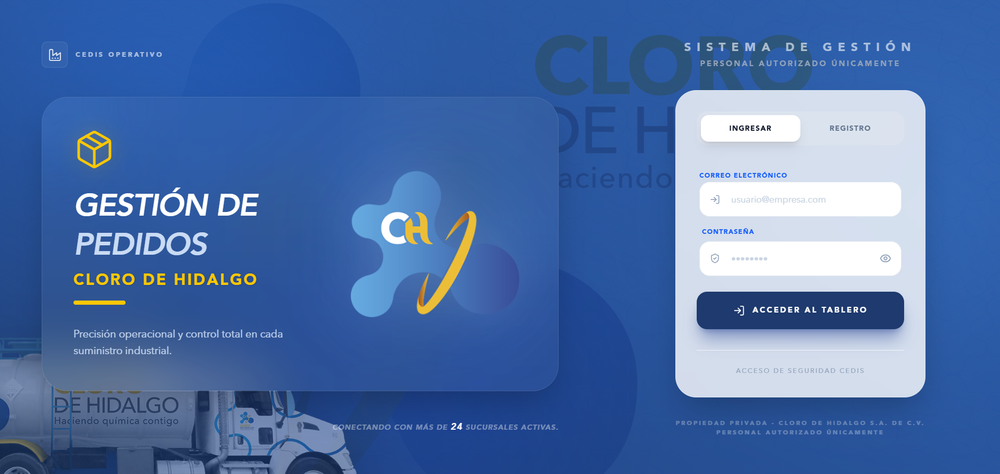 | **Seguridad Robusta**: Autenticación gestionada por Supabase Auth con niveles de acceso diferenciados por roles (`Admin`, `Branch`, `SuperAdmin`). |

---

## 📊 2. Panel de Control (Dashboards)
Interfaces personalizadas según el perfil del usuario, proporcionando KPIs relevantes y acceso rápido a las funciones críticas.

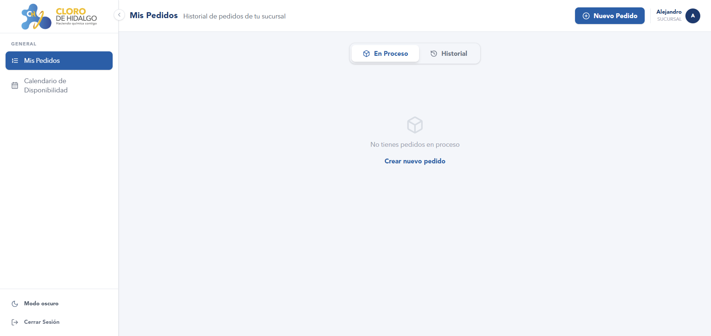
*Resumen de actividad, estatus de pedidos recientes y accesos directos operativos.*

---

## 📅 3. Gestión de Fechas y Suministro
Para una logística eficiente, el sistema coordina las entregas mediante un flujo de solicitud y aprobación de fechas tentativas.

| Paso 1: Solicitud | Paso 2: Calendario Admin | Paso 3: Aprobación |
| :---: | :---: | :---: |
| 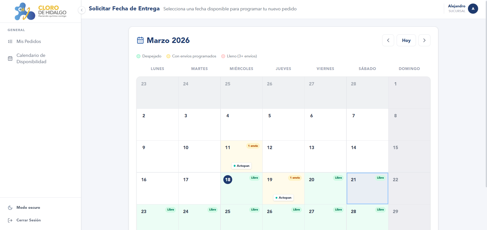 | 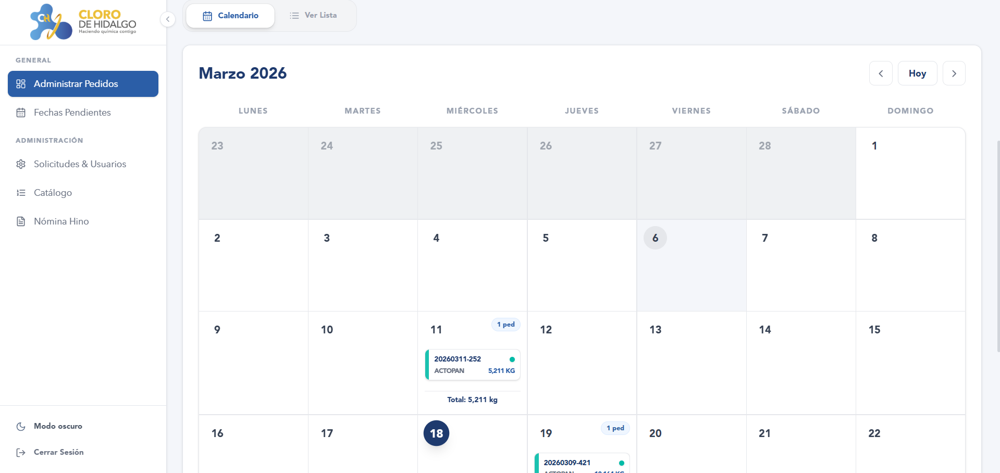 | 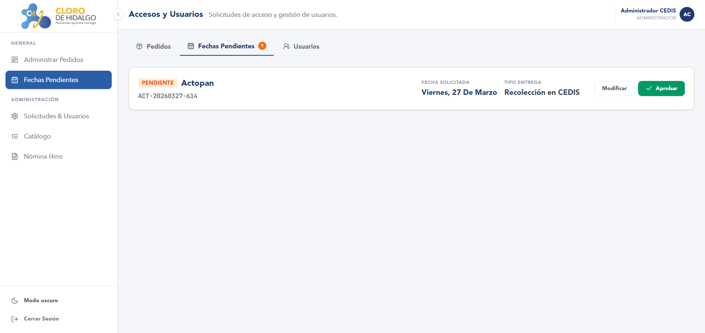 |
| La sucursal propone una fecha de recepción. | El CEDIS visualiza la carga diaria en un calendario interactivo. | El Admin valida o reprograma la cita logística. |

---

## 🛒 4. Ciclo de Vida del Pedido (Sucursal)
Un flujo intuitivo diseñado para minimizar errores operativos y optimizar la carga de las unidades.

### A. Configuración y Selección
Las sucursales seleccionan productos con visualización en tiempo real de pesos y unidades.
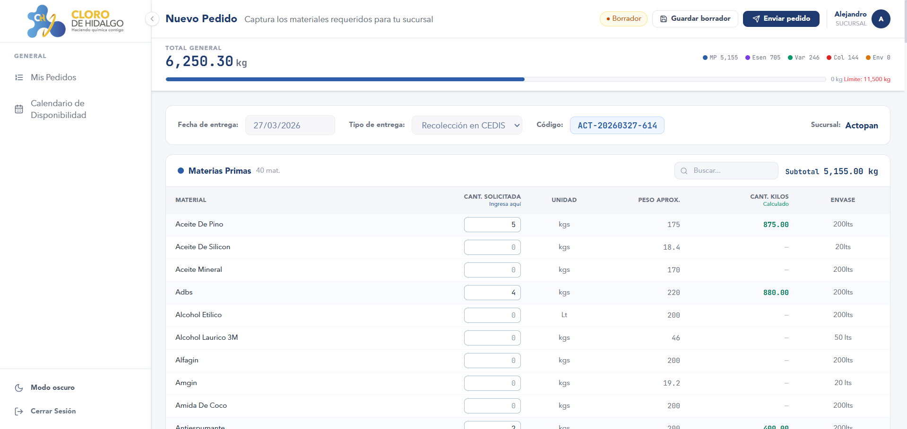

### B. Inteligencia Logística
- **Control de Peso**: Alerta visual cuando se excede la capacidad de la unidad (Tonelaje limitado).
- **Tipo de Entrega**: Configuración del transporte (Envío CEDIS, Recolección en Sucursal, Externo).

| Alerta de Peso | Tipo de Entrega | Ventana de Revisión |
| :---: | :---: | :---: |
| 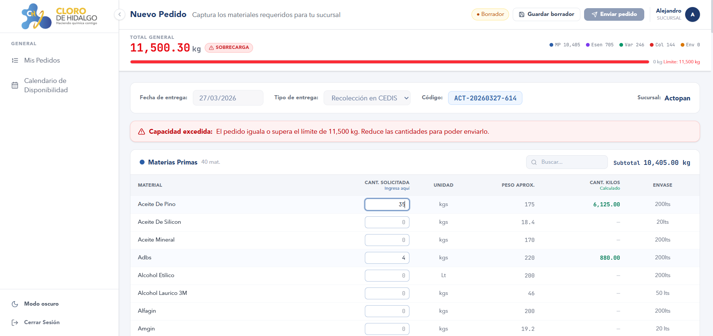 | 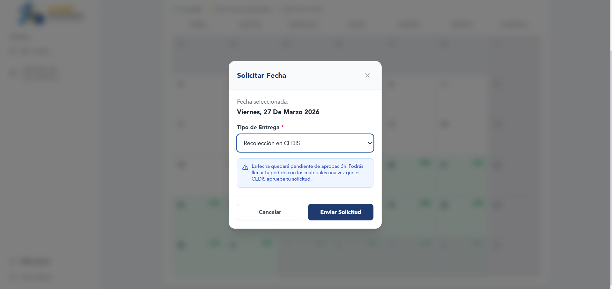 | 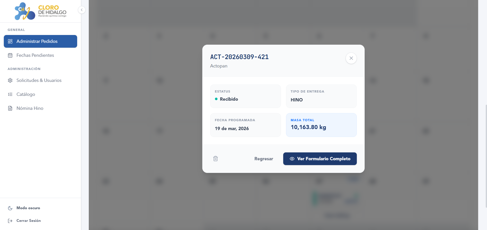 |

---

## 🏭 5. Operatividad y Despacho (CEDIS)
Gestión completa del almacén central para el surtido y expedición física de los materiales.

### Flujo de Surtido:
1.  **Recepción**: El CEDIS recibe la notificación del pedido enviado.
2.  **Puesta en Piso**: Preparación física de la mercancía en el área de carga.
3.  **Expedición**: Salida de la unidad y actualización automática de inventarios.

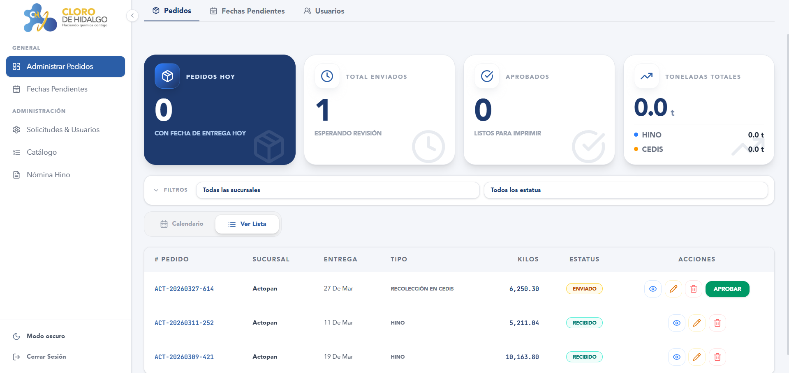
*Gestión integral del flujo de aprobación y despacho.*

---

## 🚚 6. Logística y Confirmación
Trazabilidad total del producto hasta que llega a las manos de la sucursal solicitante.

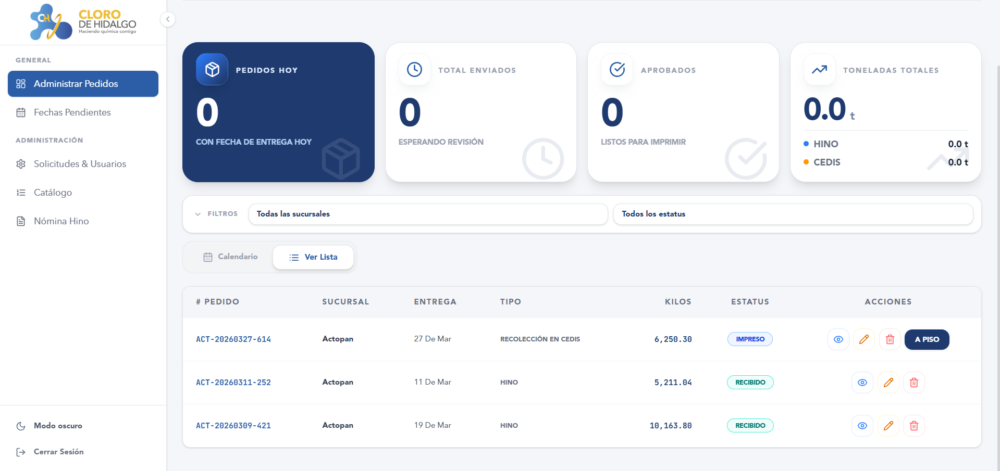 | 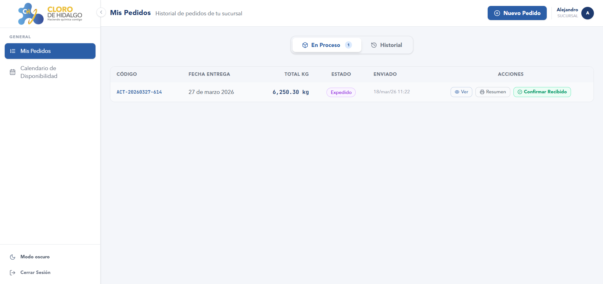
--- | ---
**Puesta en Piso**: Indicador visual de producto listo para carga. | **Recepción**: La sucursal confirma la llegada conforme del pedido.

---

## 💰 7. Módulo de Nómina e Imprimibles
Generación de documentación legal y operativa necesaria para la gestión administrativa.

### Módulo Hino (Transporte Pesado)
Generador de archivos especializados para la liquidación de nómina de operadores de flota pesada.
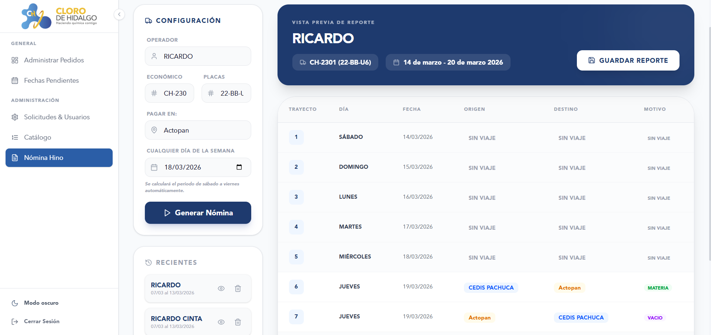

### Formatos de Surtido
Visualización y descarga de PDFs dinámicos divididos por categorías (Materias Primas, Envases, etc.) para facilitar el trabajo del personal de almacén.
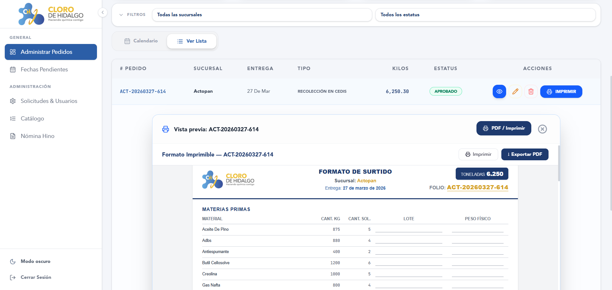

---

## 📚 8. Recursos Adicionales
- **Catálogo de Materiales**: Gestión centralizada de insumos y unidades.
- **Historial**: Auditoría detallada de todos los movimientos por sucursal.

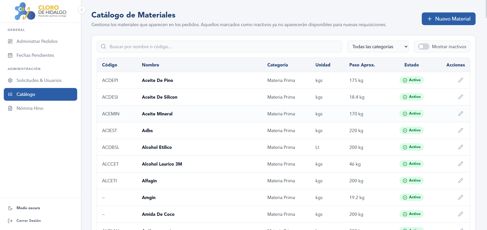 | 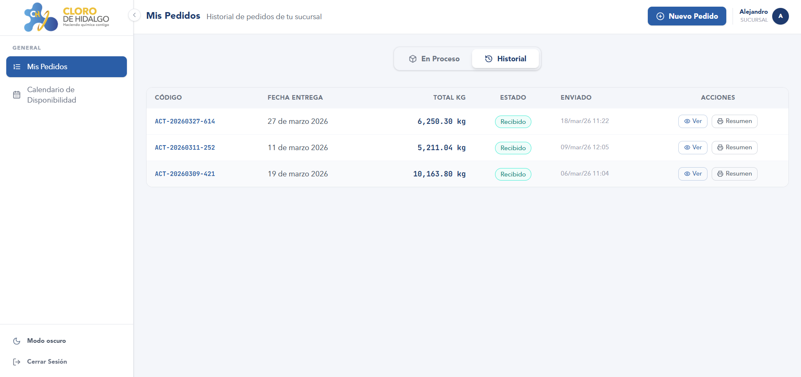
--- | ---

---

## 🛠️ Stack Tecnológico
- **Frontend**: React 18, React Router 6, Vite, Tailwind CSS.
- **Backend & DB**: Supabase, PostgreSQL.
- **Seguridad**: Row Level Security (RLS) policies.
- **UI/UX**: Lucide Icons, Framer Motion, Glassmorphism CSS Tech.

---

## ⚙️ Instalación Local

```bash
# 1. Clonar el repositorio
git clone https://github.com/AlejandroMartinezG/App_Pedidos_CEDIS.git

# 2. Instalar dependencias
npm install

# 3. Configurar variables de entorno (.env)
VITE_SUPABASE_URL=tu_url_de_supabase
VITE_SUPABASE_ANON_KEY=tu_llave_anon_de_supabase

# 4. Iniciar desarrollo
npm run dev
```

---
*Este proyecto es propiedad de Cloro de Hidalgo y está destinado exclusivamente a la gestión operativa interna de la red CEDIS.*
